# Machine Learning Workshop -- A Full-Stack Perspective

Frank Xia -- May 2018

## Machine Learning References

### Bible

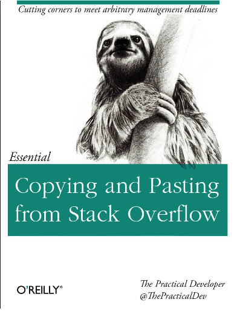

### Theory

* Frequentist
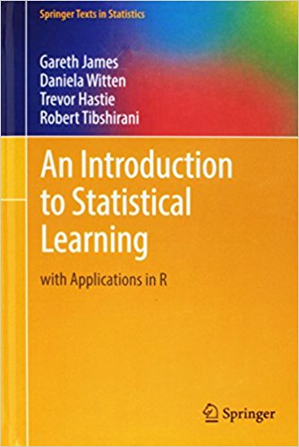
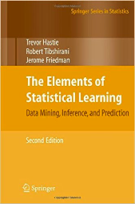

* Bayesian
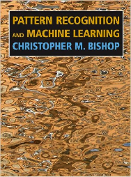
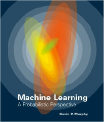

* Deep Learning
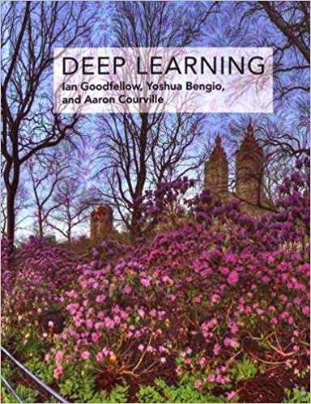
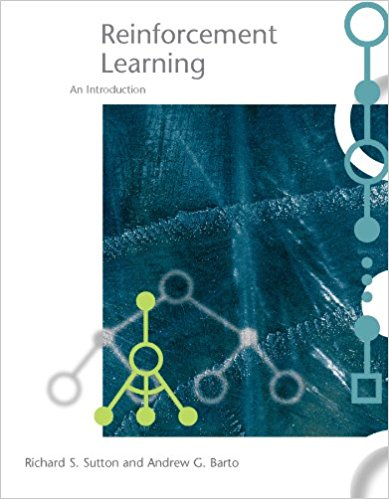

### Practical

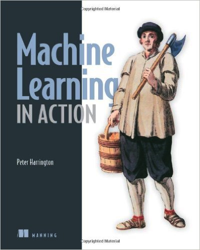
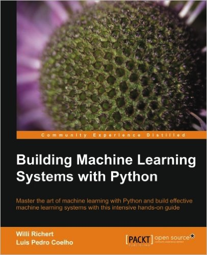

### Coding
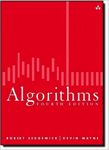
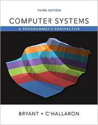
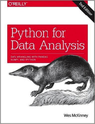
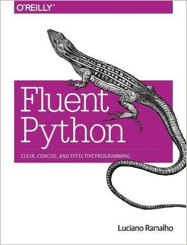
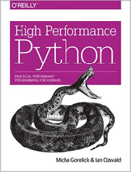
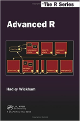
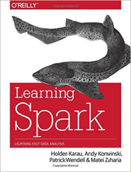
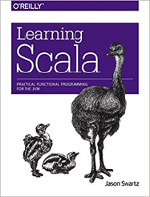

### Online Classes

* [Stanford CS229 (Advanced ML)](http://cs229.stanford.edu/)
* [Stanford CS224D (NLP)](http://cs224d.stanford.edu/)
* [Stanford CS231N (CNN)](http://cs231n.stanford.edu/)
* [UCL Course on RL (by David Silver)](http://www0.cs.ucl.ac.uk/staff/d.silver/web/Teaching.html)
* [UCB CS294 Deep Reinforcement Learning](http://rll.berkeley.edu/deeprlcourse/) 
* [Coursera Functional Programming in Scala](https://www.coursera.org/learn/progfun1) 
* [MIT 6.006 + 6.046 (Algorithms)](https://ocw.mit.edu/courses/electrical-engineering-and-computer-science/6-006-introduction-to-algorithms-fall-2011/)
* [CMU 15-213 (Intro to Computer Systems)](https://www.cs.cmu.edu/~213/)

## Machine Learning Positions

* Quant Researcher
    - [Example 1: Citadel](https://www.citadel.com/careers/details/quantitative-researcher-full-time/)
    - [Example 2: Two Sigma](https://careers.twosigma.com/careers/JobDetail/New-York-New-York-United-States-Quantitative-Research-Associate/292)
    - [Example 3: Blackrock](https://www.velvetjobs.com/job-posting/blackrock-sae-quantitative-researcher-119321)
    
* Data Scientist
    - [Example 1: Facebook](https://www.facebook.com/careers/jobs/a0I1H00000LCNWKUA5/)
    - [Example 2: Credit Karma](https://www.creditkarma.com/careers/jobs/engineering/senior-data-scientist-engineering)
    - [Example 3: Airbnb](https://www.airbnb.com/careers/departments/position/38405)
    
* Machine Learning Engineer
    - [Example 1: Opendoor](https://jobs.lever.co/opendoor/47bbc9cf-2d6e-4b5a-8f53-0050a1eb8937)

## Glossaries

## Interview Questions

## Case Studies