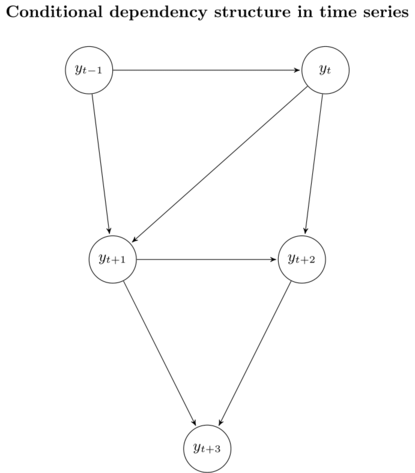
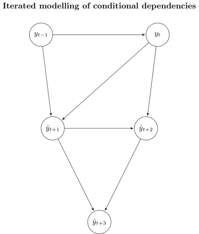
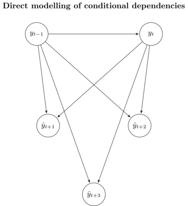
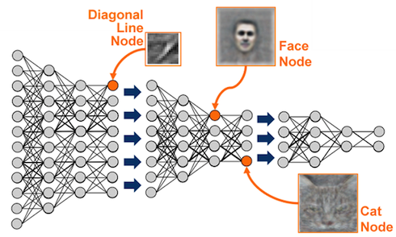
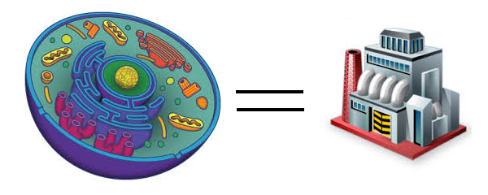

# Learn Something New

## Supervised Learning -- Revisited
A **supervised** model has following parts:

* **Data**: $X$ and $Y$
* **Parameters**: some variables you are trying to learn/fit/optimize.
* **Hyper-parameters**: some **pre-set** macros which controls model complexity and/or model behavior. For example
    * **Polynomial regression**: order $n$
    * **Multi-dimensional linear regression**: [kernels](https://en.wikipedia.org/wiki/Kernel_regression), regularization parameter $\lambda$, regularization type L1/L2
    * [**Random Forest**](http://scikit-learn.org/stable/modules/generated/sklearn.ensemble.RandomForestRegressor.html#sklearn.ensemble.RandomForestRegressor): `n_estimators`, `max_depth`, etc.
    * **Neural Network**: learning rate, activation functions, drop-out ratio, etc.
* **Algorithm**: i.e., which model? **A hyper-parameter**. Examples: 
    * [Additive](https://en.wikipedia.org/wiki/Generalized_additive_model) or multiplicative
    * [Decision tree](https://en.wikipedia.org/wiki/Decision_tree)
    * [Support vector machine](https://en.wikipedia.org/wiki/Support_vector_machine)
    * Ensembles
    * ...
* **Loss function**: **Also a hyper-parameter**. Common loss function:
    * [Mean square error](https://en.wikipedia.org/wiki/Mean_squared_error): regression
    * [Mean absolute error](https://en.wikipedia.org/wiki/Mean_absolute_error): regression
    * [Cross entropy](https://en.wikipedia.org/wiki/Cross_entropy): classification
    * negative log-[Likelihood function](https://en.wikipedia.org/wiki/Likelihood_function): probabilistic models
    * [Gram matrix](https://en.wikipedia.org/wiki/Gramian_matrix): [style transfer](http://genekogan.com/works/style-transfer/)
    * [Regularization](https://en.wikipedia.org/wiki/Regularization_(mathematics)) (can be add to any loss)
        * **AIC/BIC**: $||\beta||_0$ for simpliness
        * **L1**: $||\beta||_1$ for sparse-ness
        * **L2**: $||\beta||_2$ for small, non-zero coefficient
        * **Early stopping**: regularization in time
        * **Share parameter**: e.g., recurrent/convolutional network
        * ...
* **Optimizer**: **Again, a hyper-parameter**. How to find the best numerical solutions? For example:
    * Random guess
    * Closed-form solution
    * Gradient-based optimization
    * [Genetic algorithm](https://en.wikipedia.org/wiki/Genetic_algorithm)

## Long-term Forecasting in Machine Learning World
**Question**: Given a time-series $y_t$, What if we have want to forecast $H$ steps further in the future?

###Seasonal ARIMA?

* well-suited for short-term forecasts, not for longer term forecasts
* convergence of the autoregressive part

### Let's use ML
Still assume **assume** $y_t$ follows some additive autoregressive models: 

$$y_{t+1} = f(y_t, ..., y_{t-n+1}) + \epsilon_t$$

* **Note I didn't assume stationarity here.** (Why?)
* $f(\cdot)$ can be any machine learning model with
    * $X = [\vec y_t, ..., \vec y_{t-n+1}]$
    * $Y = \vec y_{t+1}$
    * To be more specific:
    $$X =  \begin{bmatrix}
    y_t     & y_{t-1} & \dots  & y_{t-n+1} \\
    y_{t-1} & y_{t-2} & \dots  & y_{t-n}   \\
    \vdots  & \vdots & \ddots & \vdots \\
    y_n     & y_{n-1} & \dots  & y_1
    \end{bmatrix},
        Y =  \begin{bmatrix}
    y_{t+1}  \\
    y_{t}   \\
    \vdots \\
    y_{n+1}
    \end{bmatrix} \\
    $$
    * Using [Sklearn](http://scikit-learn.org/) syntax: `f = model.fit(X, Y)`
* When $H=1$, any ML models can take care of.
* When $H>1$, things become more interesting. Three possible solutions presented here.
* **Assume $n=2$ from now on.**

#### Solution 1: Iterated forecasting
We forecast $y$'s one at a time.
$$ 
\hat y_{t+1} = f(y_t, y_{t-1}) \\
\hat y_{t+2} = f(y_{t+1}, y_{t}) \\
\vdots \\
\hat y_{t+H} = f(y_{t+H-1}, y_{t+H-2}) 
$$

**However, we are standing at time $t$. We don't know anything at $t+1$!** 

We need to replace the future by our estimates!

$$ 
\hat y_{t+1} = f(y_t, y_{t-1}) \\
\hat y_{t+2} = f(\hat y_{t+1}, y_{t}) \\
\vdots \\
\hat y_{t+H} = f(\hat y_{t+H-1}, \hat y_{t+H-2}) 
$$

* **An unbiased estimator of** $\mathbb{E}[y_{t+1:(t+H)}|y_t]$, since it preserves the stochastic dependencies of the underlying data. 
* **Bias-variance trade-off**: suffers from high variance due to the **accumulation of error in the individual forecasts**. 
* Low performance over longer time horizons H.
* When we have additional inputs, $x_t$, we need to forecast $\hat x_{t+h}$ as well!

#### Solution 2: $H$-step ahead forecasting
Learn $H$ different models:
$$
\hat y_{t+1} = f_1(y_t, y_{t-1}) \\
\hat y_{t+2} = f_1(y_t, y_{t-1}) \\
\vdots \\
\hat y_{t+H} = f_H(y_t, y_{t-1})
$$

* Does NOT suffer from the accumulation of error.
* **Models are trained independently**, no statistical dependencies between the predicted values $y_{t+h}$ are guaranteed.

#### Solution 3: Multiple input multiple output (MIMO) models
One model fits all.
$$[\hat y_{t+H}, \dots ,\hat y_{t+1}] = f(y_t, y_{t-1})$$

* No conditional independence assumptions are made.
* No accumulation of error of individual forecasts.
* All horizons $H$ are forecasted with the same model, which **limits flexibility**. 

#### Summary
* No free lunch. 
* Going to traditional ML means no uncertainty estimates.
* Work-around: [bootstrap](https://en.wikipedia.org/wiki/Bootstrapping_(statistics)#Block_bootstrap) or Bayesian regression (computationally $$)

### How to decide $n$?
* **Small $n$**: simpler model, restricted explainability. Unlikely to capture the full seasonality.
* **Big $n$**: complex model, easy to overfit, don't know where to stop.
* $n$ usually is a hyper-parameter to tune.
* Or, use a [recurrent model](https://en.wikipedia.org/wiki/Recurrent_neural_network) (i.e., $n=\infty$)

## Hyperparameter Tuning
**The most time-costly thing you will ever encounter in ML!**

### Model training
When you hear
> Let's train a model ...

it means:

1. Choose a set of hyper-parameter: 
    * **Regularizer** $\lambda$
    * **Model** $f(\cdot)$
    * **Loss** $L(y, \hat y)$
    * **Optimizer**
2. Prepare dataset, $X$ and $Y$
3. A supervised model, with parameters $\theta$, can be thus defined as
$$\hat Y = f_{\lambda}(X, \theta)$$
4. Use optimizer to solve
$$\theta^* = \text{argmin}_{\theta} L(Y, \hat Y)$$

### Model evaluations
Hyper-parameter space is (almost) infinite and non-convex. There will always be a better model:

* Impossible to achieve global maximum
* Gradient-base method cannot be used at hyper-parameter level (not always true -- 
[Learning to learn by gradient descent by gradient descent](https://arxiv.org/abs/1606.04474))

Given we have some models (with their own hyper-parameters), **how do we compare them?**

* Define an evaluation metric
    * Sharpe Ratio
    * PnL
    * Accuracies
    * Click-through rate (recommendation system)
    * ETA (dispatch system)
    * ...
* Train these models on a training set
* Evaluate on a validation set
* Pick the best model(s) with best performance on the validation set
* (Optional) Re-train the model(s) on train + validation set

**Question**: How do we choose finite models out of the infinite model domain?

### Time is money
Some benchmarks of training a model (i.e., a set of hyper-parameter) with < 10G of data:

* **Linear regressions**: gradient method, parallelizable, <1min
* **Random forest**: gradient method, parallelizable, ~10min
* **Boostings**: gradient method, cannot be parallelized, <1h

Above have well-defined functional forms. What if

* $f(\cdot)$ is explicitly unknown and multimodal.
* Evaluations of $f(\cdot)$ may be perturbed (non-convex).
* Evaluations of $f(\cdot)$ are expensive. 

Such as 

* **Neural networks**: hours ~ days

* **Dispatch algo**: hours

* **A/B Testing**: days

* **Design of experiments: gene optimization**: years?

**What are we aiming for**: Get a **good-enough model** with as fewer try as possible

### Option 1: Use previous knowledge
To select the parameters at hand. Perhaps not very scientific but still in use...

### Option 2: Grid search
* A brute force way to iterate through all possibilities.
* [Sklearn API](http://scikit-learn.org/stable/modules/generated/sklearn.model_selection.GridSearchCV.html#sklearn.model_selection.GridSearchCV)
* How to grid search?
    * discrete variables: simple iterate
    * continuous variable
        * uniform grid (e.g., hidden dimensions)
        * log grid (e.g., learning rate)
* **Curse of dimensionality!** 

### Option 3: Random search

* Some hyper-parameters are useless (won't improve model performace)
* Better than grid search in various senses but still expensive to guarantee good coverage.

**Question**: Can we do better?

### Option 4: Bayesian optimization

Given fixed data-set, $X$ and $Y$, and pre-specified evaluation metric, $L[f_\lambda(x, \theta), y]$, **hyper-parameter and model performance is a mapping**.

**Goal**: fit a function (i.e., another model), $g: \lambda \to L(f_\lambda(X_{val}, \theta), Y_{val})$

* $g$ is a non-parametric **meta-model**.
* We can only afford very few "training data" (i.e., hyper-param search) to fit $g$ -- **Bayesian models are better**.
* **State-of-art**: [Gaussian Process](https://en.wikipedia.org/wiki/Gaussian_process)
* **Illustration** [here](https://www.iro.umontreal.ca/~bengioy/cifar/NCAP2014-summerschool/slides/Ryan_adams_140814_bayesopt_ncap.pdf)
    * **Simple idea**: p8-17
    * **Simple algo**: p34-40
    * **Why doesn’t everyone use this**: p41

## Proper Backtesting

