# Machine Learning References

## Bible

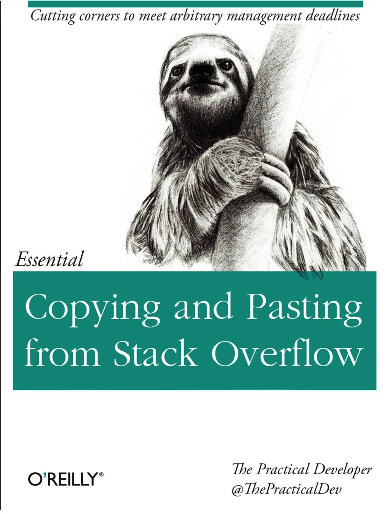

## Theory

### Frequentist

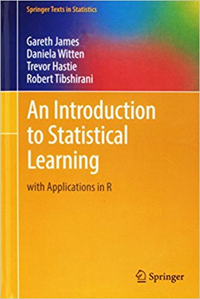

### Bayesian

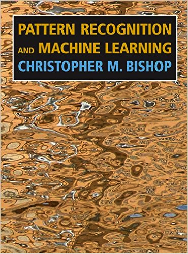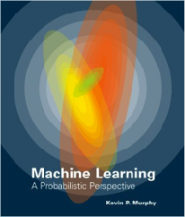

### Deep Learning

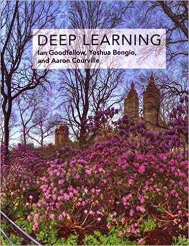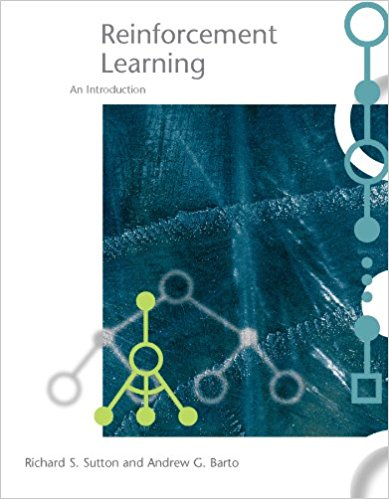

### Practical

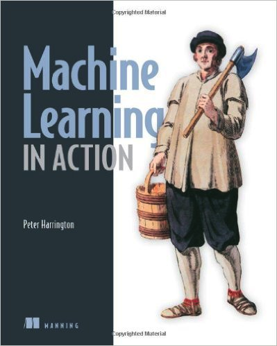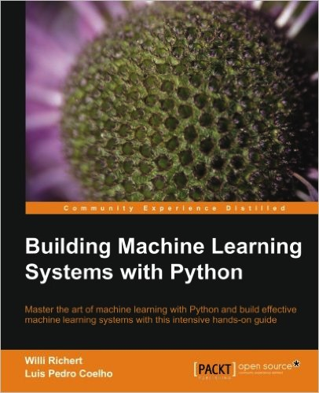

## Coding

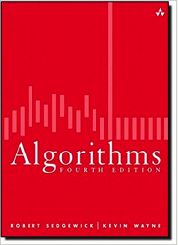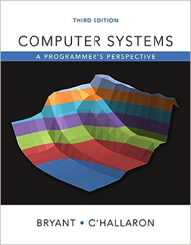
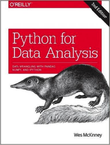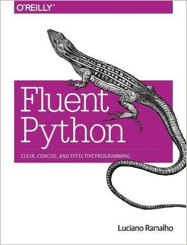
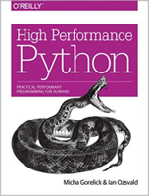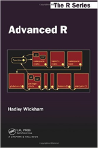
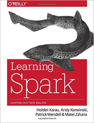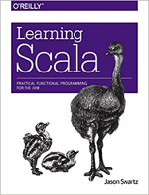

## Online Classes

* [Stanford CS229 (Advanced ML)](http://cs229.stanford.edu/)
* [Stanford CS224D (NLP)](http://cs224d.stanford.edu/)
* [Stanford CS231N (CNN)](http://cs231n.stanford.edu/)
* [UCL Course on RL (by David Silver)](http://www0.cs.ucl.ac.uk/staff/d.silver/web/Teaching.html)
* [UCB CS294 Deep Reinforcement Learning](http://rll.berkeley.edu/deeprlcourse/) 
* [Coursera Functional Programming in Scala](https://www.coursera.org/learn/progfun1) 
* [MIT 6.006 + 6.046 (Algorithms)](https://ocw.mit.edu/courses/electrical-engineering-and-computer-science/6-006-introduction-to-algorithms-fall-2011/)
* [CMU 15-213 (Intro to Computer Systems)](https://www.cs.cmu.edu/~213/)

## Other References
* [Google's Rules of Machine Learning](https://developers.google.com/machine-learning/rules-of-ml/#before_machine_learning)
* [A Tutorial on Bayesian Optimization for Machine Learning](https://www.iro.umontreal.ca/~bengioy/cifar/NCAP2014-summerschool/slides/Ryan_adams_140814_bayesopt_ncap.pdf)
* [Glossary of common Machine Learning, Statistics and Data Science terms](https://www.analyticsvidhya.com/glossary-of-common-statistics-and-machine-learning-terms) 
* [Introduction to Bayesian Optimization](http://gpss.cc/gpmc17/slides/LancasterMasterclass_1.pdf)
* [Long-term forecasting with machine learning models](https://thuijskens.github.io/2016/08/03/time-series-forecasting/)
* [Machine Learning Glossary](https://developers.google.com/machine-learning/glossary/)

