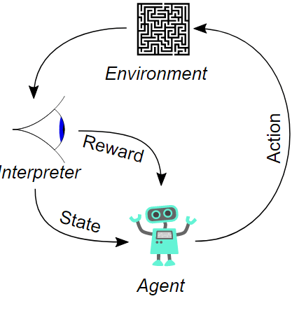

# Warm-up

## Supervised Learning
* Classification & regression
* Labeled data
* Useful for forecasting/prediction
* Usually a well defined loss function 

### Regression
* linear & non-linear regressions
* [Boostings](http://xgboost.readthedocs.io/en/latest/)

### Classification
* [Logistic regression](https://en.wikipedia.org/wiki/Logistic_regression)
* [Support vector machine (SVM)](https://en.wikipedia.org/wiki/Support_vector_machine)
* [Linear/Quadratic Discriminant Analysis (LDA/QDA)](https://en.wikipedia.org/wiki/Linear_discriminant_analysis)
* [Naive Bayes classifier](https://en.wikipedia.org/wiki/Naive_Bayes_classifier)
* [K-Nearest Neighbor (KNN)](https://en.wikipedia.org/wiki/K-nearest_neighbors_algorithm)
* [Decision Tree](https://en.wikipedia.org/wiki/Decision_tree)
* [Bagging](https://en.wikipedia.org/wiki/Bootstrap_aggregating)
* [Random Forest](https://en.wikipedia.org/wiki/Random_forest)

### Model Ensemble
> Blind men and an elephant -- Udana

## Unsupervised Learning
* Dimension reduction & density estimation & clustering & [representational learning](https://en.wikipedia.org/wiki/Feature_learning)
* Unlabeled data
* Useful for determining underlying data structures
* Less well defined loss function

### Clustering
* [K-Means](https://en.wikipedia.org/wiki/K-means_clustering)

### Dimension Reduction
* [Principle Component Analysis (PCA)](https://en.wikipedia.org/wiki/Principal_component_analysis)

### Density Estimation
* [Kernel estimation](https://en.wikipedia.org/wiki/Kernel_density_estimation)
* Histogram

## Reinforcement Learning
* There is no $y$, but **rewards**.
* Try to find the best ways to earn the greatest **reward**.
* **Rewards** can be 
    * winning a game
    * earning more money
    * beating other opponents. 
* How human interact with the world

## Neural Networks
> Neural networks are just universal approximators -- Frank Xia

* When data is sufficient, NN always outperforms traditional ML.
* Never start with NN (except vision and NLP).
    * start with traditional ML so you have a good benchmark. 
* Going to NN will lose explainability.

# Technology Stack

### Programming language

> Life is short, you need Python -- Bruce Eckel
> Life is short, I use Python -- Frank Xia

#### Python Libraries
* **Core**
    * [NumPy](https://github.com/numpy/numpy) -- vectorization!
    * [SciPy](https://github.com/scipy/scipy) -- scientific calculations
    * [Pandas](https://github.com/pandas-dev/pandas) -- you need DataFrame for data munging
* **Visualization**
    * [Matplotlib](https://github.com/matplotlib/matplotlib) -- your boss needs to you know your model performance
    * [Seaborn](https://github.com/mwaskom/seaborn) -- your boss is colorblind? No problem!
* **Machine Learning**
    * [SciKit-Learn](https://github.com/scikit-learn/scikit-learn) -- who doesn't want `model.fit()` and `model.predict()`?
* **Deep Learning**
    * [TensorFlow](https://github.com/tensorflow/tensorflow) -- by Google
    * [Keras](https://github.com/keras-team/keras) -- "What? You want `sklearn` in deep learning?"
    * [pyTorch](https://github.com/pytorch/pytorch) -- by Facebook. "What? How dare you want to do `if/else` in `TensorFlow`!"

    
#### Good Coding Practice
* User [`virtualenv`](https://virtualenv.pypa.io/en/stable/)
* Use less `jupyter notebook/lab`
* Modular your code. I.e., don't write a 500-line `main()`
* Don't listen to [functional programming](https://en.wikipedia.org/wiki/Functional_programming). I.e., use [OOP](https://en.wikipedia.org/wiki/Object-oriented_programming)!
    * But I like `lambda` functions, and [map-reduce](https://www.python-course.eu/lambda.php)
* Do `unit test`
* Write [clean code](https://www.amazon.com/Clean-Code-Handbook-Software-Craftsmanship/dp/0132350882)

### Productivity tips
* Use a [Unix-based system](https://en.wikipedia.org/wiki/Unix) -- "**StackOverflow**: How to ... on Windows"
* [GitHub](https://github.com/) -- "S**t, the code was running yesterday."
* [iTerm](https://www.iterm2.com/) and [Z-shell](http://ohmyz.sh/) -- "Why do I need a GUI? I can do this all day!"
* [Shell script](https://en.wikipedia.org/wiki/Shell_script) -- "Where is my mouse pointer?"
* [Vim](https://vim-adventures.com/) -- "Hey, Emacs is better! Holy War!"
* [tmux](https://hackernoon.com/a-gentle-introduction-to-tmux-8d784c404340) -- "Why my program got killed after closing the iTerm?"
* [SQL](https://www.w3schools.com/sql/sql_intro.asp) -- "Hey boss, can you get me `X` and `Y` in `DataFrame`?"

